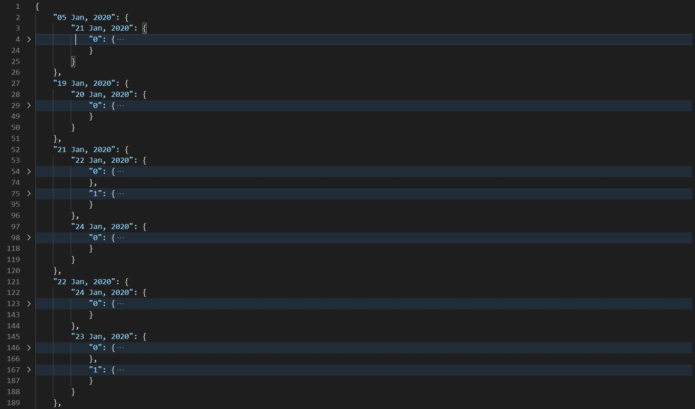
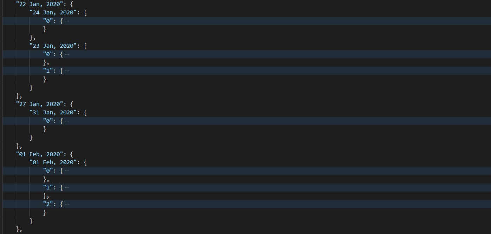
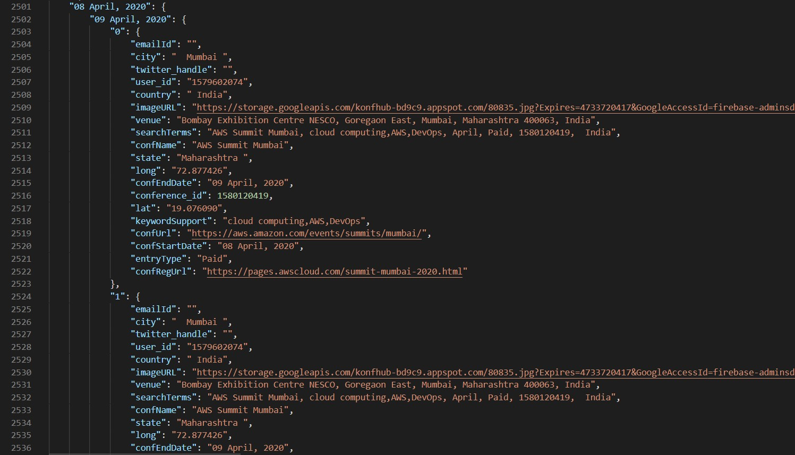
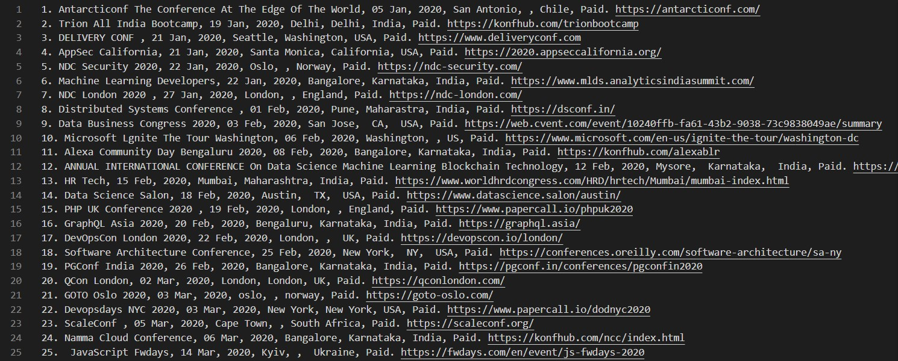
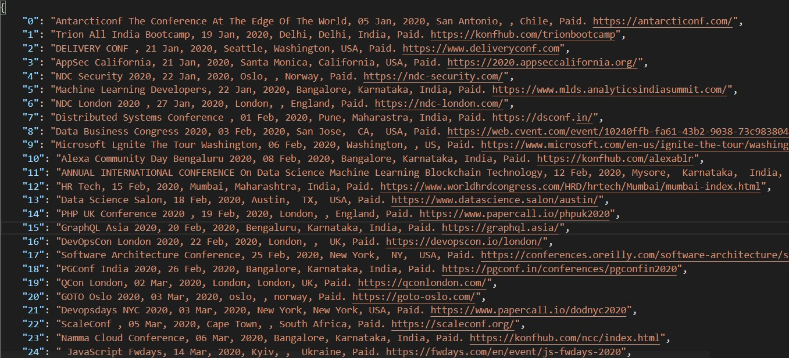
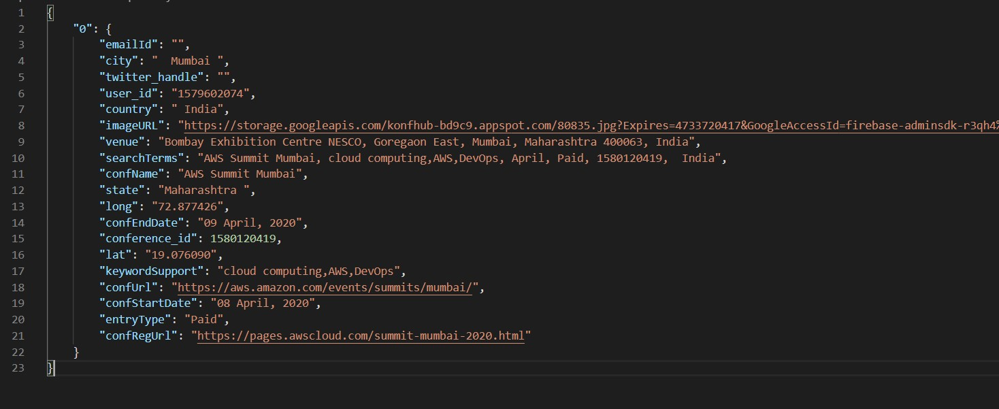
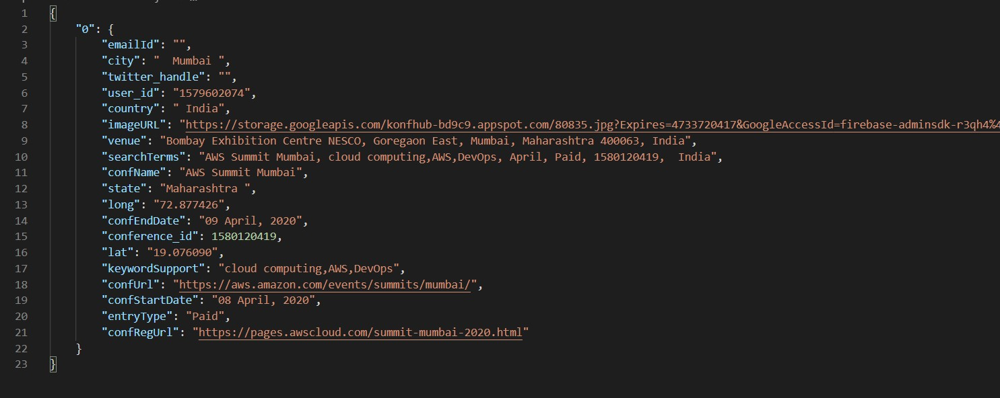

# KonfHub

## Tech Stack

- Python

## Getting Started

- Clone the repo
- Install the requirements
  ```
  pip install -r requirements.txt
  ```
- Set/ Change the enviornment variable in the `config.py` file.
- Run the `main.py` file.

## Approach

To group similar events, I tried to club the events on the basis of their start and end dates.

### Reason

Since all the events have same date format, the date will be same for duplicate/similar events and can serve as key.

A sample of the dictionary created is :



Events with same start date but different end date:


For exactly same events:



This clubbing optimizes the searching.

### Exact Match

To find the exact duplicates, every key must match.

### Similar Events

To find similar events, all keys except `confName`, `searchTerms`, `venue` must match.

## Output

Sample Outputs

Find these files in the `outputFiles` folder.

### Readable

#### TXT



#### JSON



### Exact Duplicates



### Similar Duplicates


